# SmartPOS Mobile Manager 🚀

**A Production-Ready Offline-First POS System for Mobile Shops**  
*Developed by AiLab Solution*

> "A complete mobile shop management solution with Udhaar tracking, auto-sync, and Google Drive backup"

---

## 📱 Live Demo & Download

### 📥 Download Latest APK

[](https://github.com/Somanashraf/smartpos-mobile-manager/releases/download/v1.0/app-arm64-v8a-release.apk)

> **Supports:** Android 5.0+ | **Size:** ~15MB

---

## ✨ Features at a Glance

| Feature | Description | Status |
|:--------|:------------|:------:|
| 📴 **Offline POS** | Works without internet, auto-syncs when online | ✅ |
| 🔄 **Auto Sync** | Real-time sync with Firebase on connectivity | ✅ |
| ☁️ **Google Drive Backup** | Manual + automatic daily backups | ✅ |
| 📊 **Smart Dashboard** | Live sales counter with glassmorphism UI | ✅ |
| 🧾 **Udhaar Management** | Customer ledger with debit/credit tracking | ✅ |
| 📈 **Reports & PDF Export** | Multiple report types + WhatsApp PDF sharing | ✅ |
| 📦 **Inventory Control** | Low stock alerts + product performance tracking | ✅ |
| 🔐 **Firebase Auth** | Secure email/password authentication | ✅ |

---

## 📸 Screenshots

<details>
<summary><b>🔐 Authentication</b></summary>

| Login Screen | Signup Screen |
|:------------:|:-------------:|
| 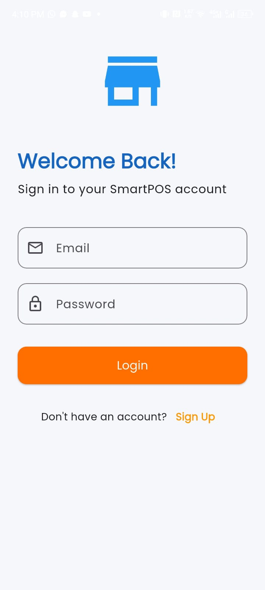 | 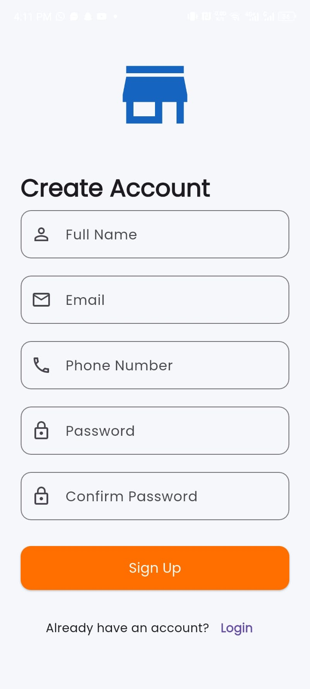 |

</details>

<details>
<summary><b>📊 Dashboard & POS</b></summary>

| Dashboard | Point of Sale |
|:---------:|:-------------:|
| 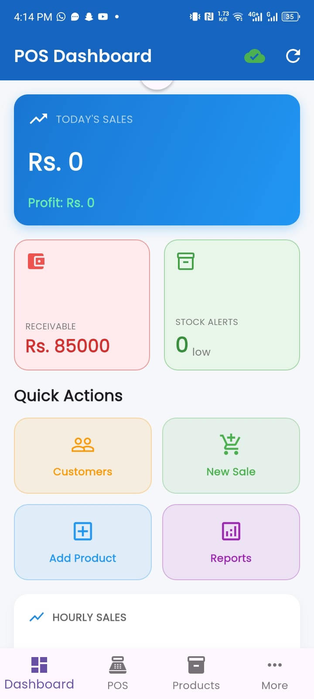 | 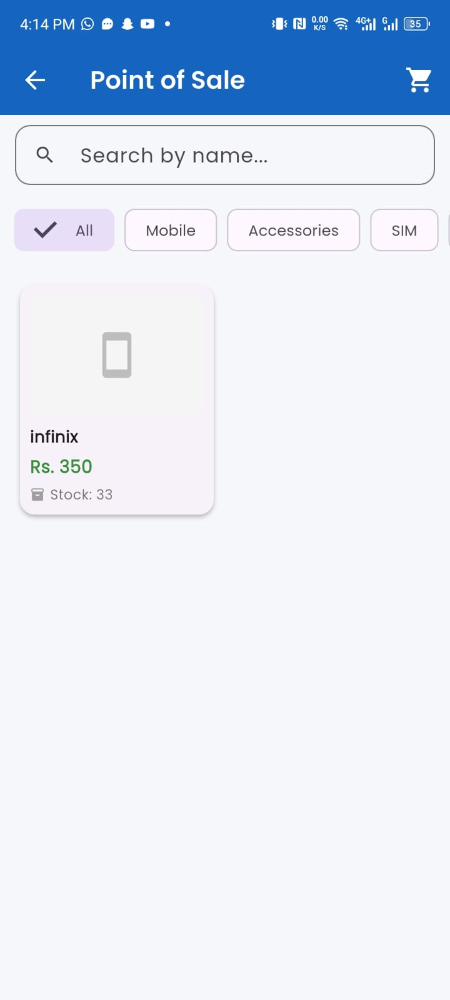 |

</details>

<details>
<summary><b>📦 Products & Inventory</b></summary>

| Products Inventory |
|:------------------:|
| 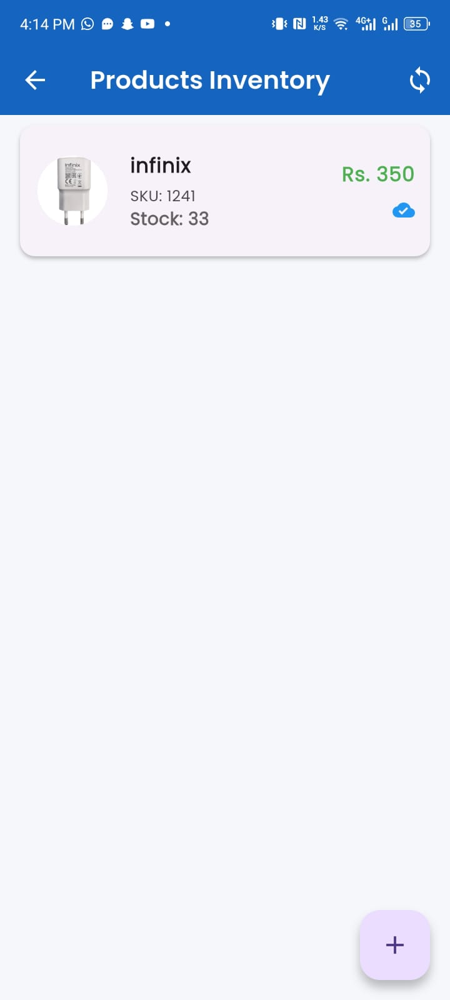 |

</details>

<details>
<summary><b>👥 Customer Management</b></summary>

| Add Customer | Customer Ledger |
|:------------:|:---------------:|
| 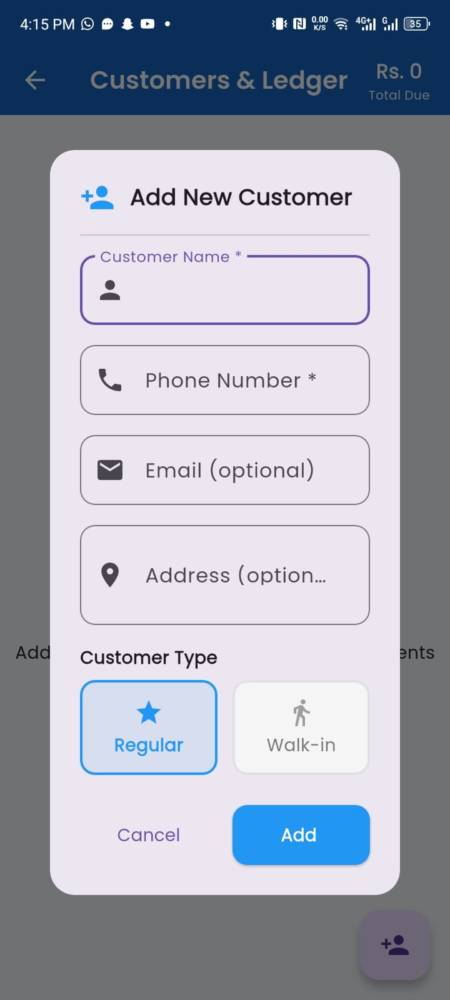 | 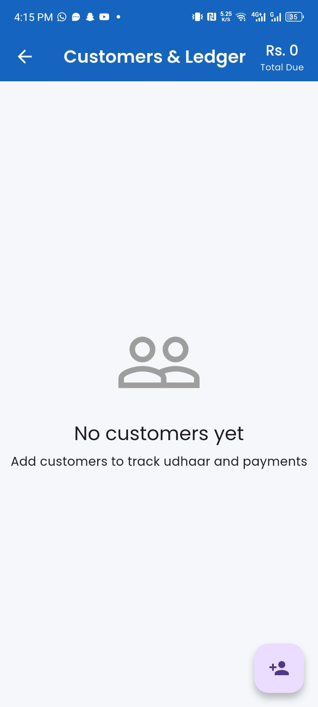 |

</details>

<details>
<summary><b>📈 Reports & Analytics</b></summary>

| Sales Report | Stock Report | Ledger Report |
|:------------:|:------------:|:-------------:|
| 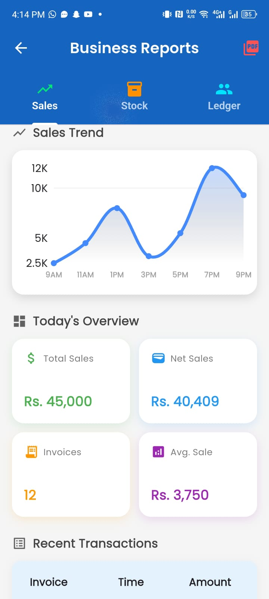 | 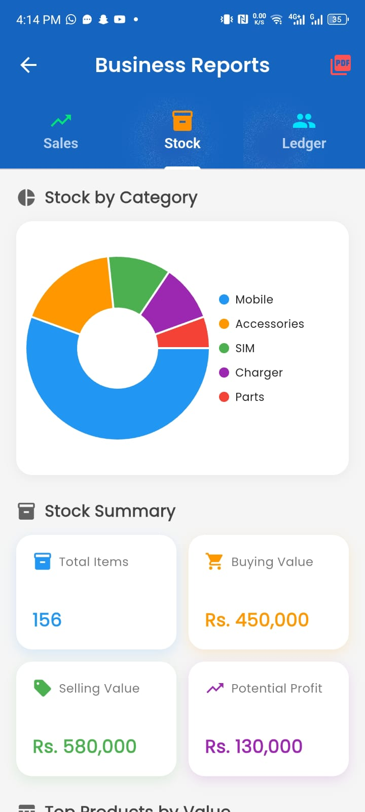 | 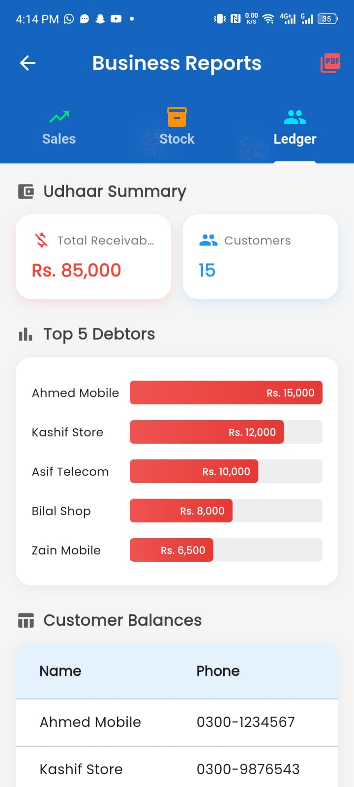 |

</details>

<details>
<summary><b>⚙️ Settings & Sharing</b></summary>

| Backup Settings | PDF Sharing |
|:---------------:|:-----------:|
| 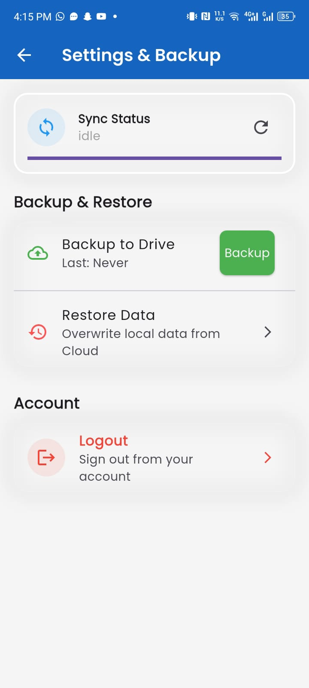 | 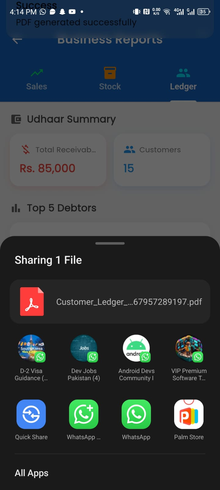 |

</details>

---

## 🛠 Installation & Setup

### Step 1: Clone Repository

```bash
git clone https://github.com/Somanashraf/smartpos-mobile-manager.git
cd smartpos-mobile-manager
```

### Step 2: Install Dependencies

```bash
flutter pub get
```

### Step 3: Configure Firebase

1. Create a Firebase project at [console.firebase.google.com](https://console.firebase.google.com)
2. Enable **Email/Password Authentication**
3. Create **Firestore Database**
4. Download `google-services.json` and place in `android/app/`

### Step 4: Build & Run

```bash
flutter run --release
```

### Step 5: Generate Release APK

```bash
flutter build apk --release --split-per-abi
```

---


## 🏢 Company Info

| Field | Details |
|:------|:--------|
| **Company** | AiLab Solution |
| **Project Lead** | Bilal Saeed |
| **Developer** | Faheem Naveed |

### ✅ Project Highlights

- ✅ Clean Architecture (SOLID Principles)
- ✅ Offline-First Implementation
- ✅ Production APK + GitHub Repository

---

## 🏗️ Architecture Highlights

### Design Patterns Used

| Pattern | Implementation |
|:--------|:---------------|
| **Clean Architecture** | Feature-based modules |
| **Repository Pattern** | Abstract data sources |
| **Use Cases** | SOLID Single Responsibility |
| **Dependency Injection** | GetX Bindings |

---

## 🛠️ Tech Stack

| Technology | Purpose |
|:-----------|:--------|
|  | Cross-platform UI Framework |
|  | State Management & Routing |
|  | Local Database (Offline) |
|  | Authentication & Cloud Sync |
|  | Backup/Restore |
| **fl_chart** | Data Visualization |
| **pdf** | Report Generation |
| **connectivity_plus** | Network Monitoring |

---

## 🔮 Future Enhancements

- [ ] 🖨️ Print Receipts via Bluetooth thermal printer
- [ ] 📷 Barcode Scanner integration
- [ ] 🏪 Multi-shop support (franchise mode)
- [ ] 📱 SMS Notifications for payment reminders
- [ ] 🌐 Urdu Language support
- [ ] 👥 Staff Management (multiple users)

---

## 📄 License

> **Academic Project**  
> Not for commercial use. Developed for educational purposes.

---

## 🤝 Contributing

This is a semester project. For academic inquiries, please contact:

| Contact | Details |
|:--------|:--------|
| 📧 **Email** | faheemnaveed09@gmail.com |
| 📱 **Phone** | +923187371655 |

---

<div align="center">

**Made with ❤️ by Faheem Naveed**  

*AiLab Solution*

</div>
